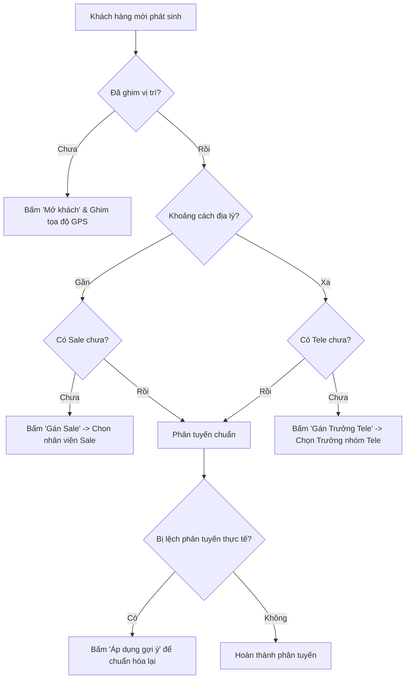

# TÀI LIỆU TRAINING: BÁO CÁO CHẤT LƯỢNG PHÂN TUYẾN

_(Dành riêng cho Phó Admin / Sub Admin)_

Tài liệu này hướng dẫn Phó Admin (Sub Admin) hiểu rõ, vận hành và xử lý các số liệu trên **Báo cáo Chất lượng Phân tuyến (Routing Quality Report)** nhằm tối ưu hóa hoạt động phân phối khách hàng cho đội ngũ kinh doanh.

---

## 1. MỤC ĐÍCH CỦA BÁO CÁO PHÂN TUYẾN

Báo cáo Chất lượng Phân tuyến là công cụ giám sát cốt lõi giúp Phó Admin quản lý dữ liệu vị trí khách hàng và điều phối nhân sự chăm sóc một cách tối ưu.

- **Đảm bảo đúng đối tượng - đúng khu vực**:
  - **Sale thị trường (Salesman)**: Tập trung chăm sóc khách hàng ở khoảng cách **GẦN** để tối ưu hóa thời gian di chuyển, chi phí đi lại và tăng tỷ lệ chốt đơn trực tiếp.
  - **Telesale (Tele-agent)**: Chăm sóc khách hàng ở khoảng cách **XA** thông qua điện thoại/zalo nhằm tiết kiệm nguồn lực di chuyển của doanh nghiệp.
- **Không bỏ sót khách hàng**: Đảm bảo mọi khách hàng mới phát sinh đều được gán ngay cho một người chịu trách nhiệm (Owner).
- **Minh bạch dữ liệu**: Ngăn ngừa tình trạng tranh chấp khách hàng giữa các Sale/Tele thông qua cơ chế ghi vết lịch sử tự động.

---

## 2. Ý NGHĨA 6 CHỈ SỐ KPI CHẤT LƯỢNG PHÂN TUYẾN

Trên giao diện báo cáo, Phó Admin cần theo dõi sát sao 6 chỉ số KPI sau:

| KPI                           | Ý nghĩa                                                                                                                                             | Trạng thái mong muốn | Hành động của Phó Admin                                                                         |
| :---------------------------- | :-------------------------------------------------------------------------------------------------------------------------------------------------- | :------------------- | :---------------------------------------------------------------------------------------------- |
| **1. Có tọa độ**              | Tỷ lệ khách hàng đã xác định vị trí GPS trên bản đồ. Đây là điều kiện bắt buộc để hệ thống đo khoảng cách phân tuyến.                               | **100%**             | Theo dõi và đôn đốc đội ngũ cập nhật vị trí khách hàng.                                         |
| **2. Chưa ghim vị trí**       | Số lượng khách hàng mới chỉ có địa chỉ bằng chữ viết (text) nhưng **chưa được ghim tọa độ GPS** trên bản đồ.                                        | **Bằng 0**           | Bấm **"Mở khách"** để xác định tọa độ GPS chính xác dựa trên địa chỉ text.                      |
| **3. Khách gần chưa có Sale** | Khách hàng có khoảng cách gần (trong bán kính phục vụ) nhưng **chưa được gán cho nhân viên Sale thị trường** nào quản lý.                           | **Bằng 0**           | Bấm **"Gán Sale"** để chọn nhân sự phụ trách địa bàn tương ứng chăm sóc trực tiếp.              |
| **4. Khách xa chưa có Tele**  | Khách hàng ở khoảng cách xa nhưng **chưa được gán cho Trưởng nhóm Telesale** để phân phối tiếp xuống nhân viên.                                     | **Bằng 0**           | Bấm **"Gán Trưởng Tele"** để chuyển thông tin về cho đội Telesale liên hệ từ xa.                |
| **5. Phân tuyến chuẩn**       | Số lượng khách hàng được phân chia tối ưu (Khách gần có Sale phụ trách, Khách xa có Tele phụ trách).                                                | **Tối đa hóa**       | Duy trì trạng thái này. Không cần xử lý gì thêm.                                                |
| **6. Lệch phân tuyến**        | Khách hàng đang bị gán sai luồng chăm sóc (Ví dụ: Khách ở rất xa nhưng lại gán cho Sale đi gặp, hoặc khách rất gần nhưng lại chỉ có Tele chăm sóc). | **Bằng 0**           | Bấm **"Áp dụng gợi ý"** để hệ thống tự động chuẩn hóa lại mô hình chăm sóc và loại khoảng cách. |

---

## 3. HƯỚNG DẪN XỬ LÝ HÀNH ĐỘNG NHANH (STEP-BY-STEP)

Phó Admin xử lý trực tiếp các lệch lạc phân tuyến thông qua các hành động nhanh tích hợp sẵn trong báo cáo:

### 3.1. Khi nào bấm "Gán Sale"?

- **Đối tượng**: Khách hàng thuộc nhóm **"Khách gần chưa có Sale"**.
- **Thao tác**:
  1. Bấm nút **"Gán Sale"** ở dòng khách hàng tương ứng.
  2. Dialog chọn nhân sự mở ra, lọc sẵn danh sách nhân viên có vai trò `sale` (lấy từ dữ liệu hệ thống).
  3. Chọn nhân viên Sale phụ trách khu vực của khách và bấm **Xác nhận**.
- **Kết quả tự động của hệ thống**:
  - Trường `owner_sale_id` của khách hàng được cập nhật.
  - Tự động tạo 1 Task công việc mới cho Sale đó với tiêu đề _"Liên hệ khách hàng [Tên khách] từ phân tuyến"_, hạn chót là ngày mai.
  - Gửi một Notification (Thông báo) trực tiếp đến tài khoản của Sale: _"Bạn đã được giao khách hàng mới..."_.
  - Ghi lại lịch sử hoạt động vào bảng `customer_activity` để đối soát sau này.

### 3.2. Khi nào bấm "Gán Trưởng Tele"?

- **Đối tượng**: Khách hàng thuộc nhóm **"Khách xa chưa có Tele"**.
- **Thao tác**:
  1. Bấm nút **"Gán Trưởng Tele"**.
  2. Dialog hiển thị danh sách toàn bộ các **Trưởng nhóm Telesale** (`tele_lead`).
  3. Chọn Trưởng nhóm phụ trách line và bấm **Xác nhận**.
- **Kết quả tự động của hệ thống**:
  - Trường `owner_tele_id` của khách hàng được cập nhật.
  - Tự động tạo Task công việc cho Trưởng nhóm Tele để họ tiếp tục phân chia cho nhân viên Telesale cấp dưới.
  - Bắn Notification thông báo cho Trưởng nhóm Tele.
  - Ghi lại hoạt động vào hệ thống lịch sử.

### 3.3. Khi nào chỉ mở khách để ghim vị trí?

- **Đối tượng**: Khách hàng thuộc nhóm **"Chưa ghim vị trí"**.
- **Thao tác**:
  1. Bấm nút **"Mở khách"** (Hệ thống sẽ trượt ngăn kéo thông tin chi tiết khách hàng lên).
  2. Xem địa chỉ bằng chữ của khách hàng, tra cứu Google Maps để lấy tọa độ chính xác.
  3. Sử dụng bản đồ ghim trên ngăn kéo chi tiết để chấm/ghim chính xác tọa độ GPS của khách rồi bấm **Lưu**.
- **Lưu ý**: Sau khi lưu tọa độ thành công, khách hàng sẽ tự động biến mất khỏi nhóm _"Chưa ghim vị trí"_ và tự động được hệ thống tính toán khoảng cách để xếp vào nhóm phân tuyến hợp lý.

### 3.4. Khi nào áp dụng gợi ý phân tuyến?

- **Đối tượng**: Khách hàng thuộc nhóm **"Lệch phân tuyến"**.
- **Nguyên nhân lệch**: Khoảng cách địa lý thực tế hiển thị khách ở **Gần** nhưng mô hình chăm sóc hiện tại lại đang để là **Telesale**, hoặc khách ở rất **Xa** nhưng mô hình chăm sóc lại đang phân bổ cho **Sale thị trường**.
- **Thao tác**:
  1. Bấm nút **"Áp dụng gợi ý"**.
  2. Hệ thống sẽ tự động cập nhật lại các trường: Kênh khách hàng (`customer_channel`), Loại khoảng cách (`customer_distance_type`), và Mô hình chăm sóc (`care_model`) về đúng quy chuẩn tối ưu.
- **Lưu ý cực kỳ quan trọng**: Thao tác này **KHÔNG** tự động ghi đè hay thay đổi người sở hữu (`owner_sale_id`/`owner_tele_id`) hiện tại để tránh việc cướp khách hoặc phá vỡ các giao dịch đang chăm sóc dở dang của nhân viên. Muốn đổi người sở hữu, Admin phải thực hiện gán thủ công sau khi đã trao đổi nội bộ.

---

## 4. NGUYÊN TẮC "3 KHÔNG" - NHỮNG ĐIỀU CẤM KỴ

Để đảm bảo hệ thống vận hành trơn tru và dữ liệu chính xác, Phó Admin bắt buộc phải tuân thủ nguyên tắc **"3 KHÔNG"**:

> [!WARNING]
>
> ### 1. KHÔNG GÁN BỪA KHÁCH CHƯA KIỂM TRA
>
> - Tuyệt đối không gán khách hàng cho nhân sự Sale khi chưa kiểm tra địa bàn hoạt động thực tế của họ.
> - Việc gán sai khu vực địa lý sẽ làm Sale mất công di chuyển xa, giảm hiệu suất làm việc hoặc dẫn đến bỏ bê, trôi nổi Task chăm sóc.

> [!CAUTION]
>
> ### 2. KHÔNG ÁP DỤNG GỢI Ý NẾU ĐỊA CHỈ/TỌA ĐỘ SAI
>
> - Nếu tọa độ GPS của khách hàng bị ghim sai vị trí thực tế (ví dụ: Địa chỉ ghi ở Hà Nội nhưng tọa độ lại ghim nhầm ở Cà Mau), hệ thống sẽ tính toán khoảng cách sai và đưa ra gợi ý phân tuyến bị lệch.
> - **Quy trình chuẩn**: Phó Admin phải đối chiếu địa chỉ text trước. Nếu thấy tọa độ ghim bị sai lệch nghiêm trọng, bắt buộc phải cập nhật lại tọa độ GPS trước, tuyệt đối không bấm "Áp dụng gợi ý" ngay lập tức.

> [!IMPORTANT]
>
> ### 3. KHÔNG ĐỔI OWNER KHI CHƯA CÓ LÝ DO HỢP LỆ
>
> - Không tùy tiện thay đổi nhân sự phụ trách (`owner_sale_id` hoặc `owner_tele_id`) của khách hàng khi họ đang tương tác và chăm sóc tốt.
> - Việc thay đổi người sở hữu chỉ được thực hiện khi:
>   - Nhân sự cũ nghỉ việc hoặc chuyển công tác, chuyển địa bàn.
>   - Có yêu cầu luân chuyển khách hàng chính thức từ Trưởng bộ phận.
> - Mọi thao tác thay đổi owner đều được lưu vết chi tiết trên hệ thống để đối soát và xử lý kỷ luật nếu vi phạm.

---

## 5. CHECKLIST HẰNG NGÀY CHO PHÓ ADMIN (SOP VẬN HÀNH DAILY)

Dưới đây là checklist công việc hằng ngày của Phó Admin nhằm duy trì chất lượng phân tuyến ở mức tối ưu. Phó Admin cần hoàn thành đầy đủ các đầu mục này:

### ☀️ ĐẦU GIỜ SÁNG (08:00 - 08:30)

- [ ] **Mở Báo cáo Chất lượng Phân tuyến** trên Dashboard.
- [ ] **Xử lý nhóm "Chưa ghim vị trí"**:
  - [ ] Duyệt từng khách hàng chưa có tọa độ.
  - [ ] Bấm **"Mở khách"**, tìm kiếm địa chỉ chính xác và ghim GPS.
- [ ] **Xử lý nhóm "Khách gần chưa có Sale"**:
  - [ ] Bấm **"Gán Sale"**, chọn đúng Sale phụ trách địa bàn tương ứng và xác nhận.
- [ ] **Xử lý nhóm "Khách xa chưa có Tele"**:
  - [ ] Bấm **"Gán Trưởng Tele"**, chuyển về đúng Trưởng nhóm Tele phụ trách line tương ứng và xác nhận.

### 🌤️ GIỮA NGÀY (14:00 - 14:30)

- [ ] **Rà soát dữ liệu mới**:
  - [ ] Quét nhanh xem có khách hàng mới đổ về từ Landing Page/Marketing bị thiếu thông tin định vị hoặc chưa được phân vai tự động hay không để xử lý ngay, tránh tồn đọng.

### 🌙 CUỐI NGÀY (16:30 - 17:00)

- [ ] **Xử lý nhóm "Lệch phân tuyến"**:
  - [ ] Kiểm tra các khách hàng bị hệ thống báo lệch phân tuyến.
  - [ ] Nếu thông tin tọa độ chuẩn xác, tiến hành bấm **"Áp dụng gợi ý"** để hệ thống tự động điều chỉnh luồng chăm sóc tối ưu.
- [ ] **Đảm bảo KPI cuối ngày**:
  - [ ] Mục tiêu: KPI **Chưa ghim vị trí**, **Khách gần chưa có Sale**, và **Khách xa chưa có Tele** đều được giải quyết đưa về mức **bằng 0 (hoặc tối thiểu nhất)**.
  - [ ] Đảm bảo tất cả các Task mới trong ngày đã được gửi thành công đến tài khoản của Sale và Trưởng nhóm Telesale chịu trách nhiệm.

---

_Chúc đội ngũ Phó Admin vận hành hệ thống hiệu quả, tối ưu hóa tối đa nguồn lực doanh nghiệp!_
